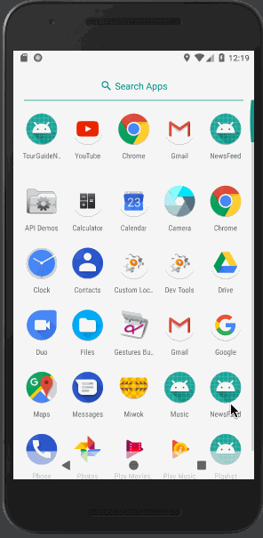

# News Feed App
> A single page app that gives a user regularly-updated news from the internet related to a particular topic, person, or location. Can access more detail by clicking the item.

## Getting Started

* You can *[clone](https://github.com/arrickx/NewsFeed.git)* or *[download](https://github.com/arrickx/NewsFeed.git)* this project via [GitHub](https://github.com) to your local machine.
* Download and Install *[Android Studio](https://developer.android.com/studio/index.html)*

### How to use

* Open existing Android Studio Project
* Use Android Studio emulators to run this app
* (Or use your Android phone to run this app via Android Studio)

## License

* This project is licensed under the MIT License - see the [LICENSE](LICENSE) file for details.

